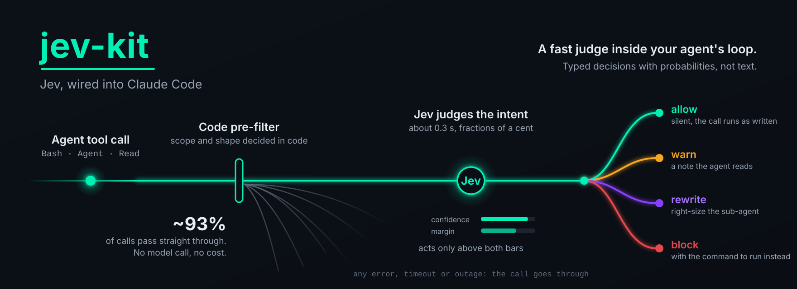
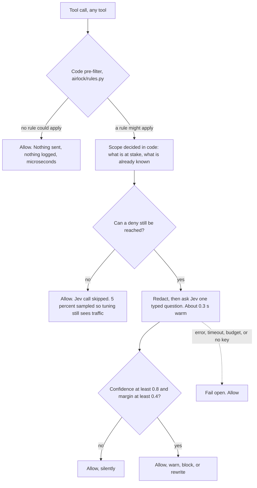
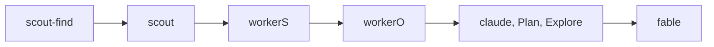

<div align="center">

<h1>jev-kit</h1>

<p>
  <strong>Everything you need to run TypeSafe's Jev with Claude Code:</strong><br/>
  guard your agent's tool calls, right-size its sub-agents, and wire Jev into
  search, browsing, review and more.
</p>

<p>
  <a href="LICENSE"></a>
  
  
  
  
  
</p>

<p>
  <a href="#quickstart">Quickstart</a> &middot;
  <a href="#what-is-in-the-kit">What is in the kit</a> &middot;
  <a href="#how-it-works">How it works</a> &middot;
  <a href="#measured-results">Measured results</a> &middot;
  <a href="#safety-model">Safety</a> &middot;
  <a href="#faq">FAQ</a>
</p>



</div>

## What is Jev, and why a kit

Jev is a TypeSafe System One model. It does not return text. It returns a typed
decision -- yes or no, a choice, a score -- with a probability attached, in
roughly 0.3 s, for a fraction of a cent. That is fast enough and cheap enough
to sit inside an agent's loop as a judge rather than beside it as another chat.

A kit, because the judge is the easy part. The work is the places it pays off:
which tool call to question, which sub-agent rung a task needs, what to redact
before sending, and how to fail open when no answer arrives. This repository is
that wiring, built and measured.

## Quickstart

```bash
git clone https://github.com/jonathanavis96/jev-kit.git ~/code/jev-kit
cd ~/code/jev-kit
install/install.sh          # guard + daemon + monitoring + filesearch
                            # + claude-update + belay, all under $HOME
```

**On native Windows without WSL**, that is not the install: the installer is
Python, not bash. Follow
**[docs/INSTALL-WINDOWS.md](docs/INSTALL-WINDOWS.md)** instead.

`install.sh` never runs `sudo`, never writes outside `$HOME`, and never edits a
`settings.json` unless you pass `--wire`. Without `--wire` it prints the exact
JSON to add and stops. `--check-only` prints the plan and installs nothing.

**The one thing a human supplies** is a `TYPESAFE_API_KEY`. Every component in
the kit reads the same one, so it lives at a kit-level path:

```bash
mkdir -p ~/.config/jev-kit && chmod 700 ~/.config/jev-kit
touch ~/.config/jev-kit/env && chmod 600 ~/.config/jev-kit/env
$EDITOR ~/.config/jev-kit/env        # one line: TYPESAFE_API_KEY=...
```

Type it into the file with an editor. **Never print it**, never paste it into a
session, never echo it back to confirm it. Without a key everything still
installs and still fails open; only the code-only rules fire.

### Prove it works

`install/doctor.sh` runs a real deny and a real allow through the actual hook
process against a throwaway `HOME`. To see it with your own hands, pipe a fake
`PreToolUse` event at the hook:

```bash
printf '%s' '{"session_id":"t","cwd":"/tmp","tool_name":"Bash","tool_input":{"command":"xdg-open https://example.com"}}' \
  | AIRLOCK_MODE=enforce python3 ~/.local/share/airlock/current/hooks/airlock.py
```

That prints JSON containing `"permissionDecision": "deny"`. An ordinary command
prints **nothing at all**:

```bash
printf '%s' '{"session_id":"t","cwd":"/tmp","tool_name":"Bash","tool_input":{"command":"echo hello"}}' \
  | AIRLOCK_MODE=enforce python3 ~/.local/share/airlock/current/hooks/airlock.py
```

### Shadow first, then enforce

The default is **shadow**: the real rules table runs, the log records what
enforce would have done, and nothing is blocked. Read the log for a while, then
arm it.

```bash
python3 -m airlock.report                 # what shadow mode would have done
echo enforce > ~/.config/airlock/mode     # a deny now blocks
echo shadow  > ~/.config/airlock/mode     # back to log-only
```

Kill switch, which beats the mode entirely: `export AIRLOCK_DISABLE=1` for this
shell, or `touch ~/.config/airlock/disabled` for the machine.

> ### Or tell your agent
>
> Paste this into Claude Code:
>
> *"Install jev-kit from https://github.com/jonathanavis96/jev-kit -- follow
> docs/install.md, run `install/install.sh --check-only` first and show me the
> plan, ask me for the TYPESAFE_API_KEY rather than printing one, leave it in
> shadow mode, and prove a deny works before telling me it is done."*

Full detail, flags, config file, WSL, rollback and the agent checklist:
**[docs/install.md](docs/install.md)**.

## What is in the kit

Airlock is the tool-call guard. It is one component of the kit, not the kit.

`Exercised` means unit tests, a labelled eval, a measured bench and real daily
use on at least one machine. `Experimental` means the logic has unit tests and
the component has been run by hand, but has no labelled corpus, no measured
numbers and no sustained real use.

| Component | What it does | Default | What leaves the machine | Exercised |
|---|---|---|---|---|
| **Guards** | | | | |
| Airlock, the tool-call guard | Judges each `PreToolUse` call against a rules table and, for the ambiguous half, one typed Jev question | **yes** | Redacted summaries of the ambiguous fraction of tool calls | exercised |
| Tier guard | Checks the sub-agent rung a dispatch chose against the task Jev judges it to be | **yes**, part of the guard | The dispatch's description and prompt, redacted | exercised |
| Belay | When an agent says it is finished with no passing check behind it, sends it back to verify | **yes** | Task text, final message and check commands, redacted and capped | exercised |
| **Speed and cost** | | | | |
| Warm daemon | Holds a warm connection so a judgement costs about 0.3 s instead of about 0.9 s | **yes** | Nothing of its own | exercised |
| Compaction | Installer for the community `fast-jev-compaction` plugin | no, opt-in | **Up to about 25,000 tokens of raw, unredacted tool inputs and results per request** | never enabled here |
| File search | Per-user `plocate` index of `$HOME` and its hourly timer | **yes** | Nothing. Entirely local | exercised |
| File search (Windows) | Detects [Everything](https://www.voidtools.com/) (`es.exe`) and its index and steers searches at it. **Detects only: it never installs either**, and says what the human must do instead | **yes** on Windows, n/a elsewhere | Nothing. Entirely local | run on one Windows 11 machine |
| **Uses** | | | | |
| Browser agent | A Jev-decided browser agent, cloned and patched at a pin | no, opt-in | Page state and goals, to the decider you configure | own numbers |
| Review | A Jev code reviewer at a pin, with a fail-open wrapper | no, opt-in | Diffs, to whatever review gate you configure | no numbers here |
| Document classifier | Two-stage classifier with an escape hatch and a confidence gate | no | Page text, when you call it | **experimental** |
| Log triage | Redact-first, local-rules-first triage on stdin | no | Nothing until local rules are exhausted; redacted lines after | **experimental** |
| Shim | An OpenAI-shaped HTTP shim over the `claude` CLI | no, opt-in | Whatever you send through it | **experimental** |
| **Operations** | | | | |
| Installer and doctor | One installer, a doctor that runs real calls, deploy, rollback, wire | n/a | Nothing | exercised |
| Monitoring | Five-minute health check, its timer, optional push to a monitor you host | **yes** | Nothing, unless you set a push URL | exercised |
| Tuning loop | Reads the shadow log, has a judge score the verdicts, commits to its own branch | no, opt-in | Real Claude sessions on the account you nominate | exercised |
| Auto-updater | Idle-only Claude Code updater. Updates only when no run is alive | **yes** | Nothing | exercised |

Per-component detail, exposure and install flags:
**[docs/components.md](docs/components.md)**. The rules themselves:
**[docs/rules.md](docs/rules.md)**.

## How it works

The hook is registered for **every** tool. What filters a call is not the
matcher but the rules table, and the cheap paths come first: most calls never
reach the network, and a call no rule covers costs nothing and logs nothing.



The tier guard runs the same way on an `Agent` dispatch. It asks Jev what kind
of task this really is, maps that to a rung on your ladder, and acts on the
gap:



| gap between chosen rung and needed rung | what happens |
|---|---|
| cheaper than the task needs | logged as under-tiered. Never blocked, never corrected upward |
| the right rung | nothing at all |
| one rung too expensive | allowed, with a two-line note naming the cheaper `subagent_type` |
| two or more rungs too expensive | blocked, with the cheaper type named in the reason |
| `fable` with no prior failed attempt stated | blocked |

The ladder is yours: `~/.config/airlock/tiers.json` overrides the built-in one,
because agent type names differ per machine. Rewrite mode, which edits the
dispatch instead of advising, exists and is off by default for a reason spelled
out in [docs/rules.md](docs/rules.md#rewrite-mode-off-by-default-and-here-is-the-catch).

## Measured results

Every number below was measured in this repository, on a stated date, by a
stated command, on a 4 vCPU cloud VM in Europe (Ubuntu, 8 GB RAM, Python 3.14).
Nothing is extrapolated.

| What | Number | How it was measured |
|---|---|---|
| Hook latency, no rule matches | **33.2 ms** median, 42.4 ms p95 (Bash); 26.9 ms median (Write) | `python3 tests/latency_hook.py 200`, 2026-09-19. Real hook processes, temp `HOME`, no key, nothing reached the network. Bare `python3 -c pass` is about 23 ms here |
| Hook latency, code-only decision | **37.7 ms** median (deny); 36.5 ms (warn) | same run |
| Judgement latency | about **0.3 s** warm daemon, about 0.9 s cold HTTPS | round figures for a single call on an idle daemon |
| Judgement throughput | **572 ms** mean per judgement | 58 real Jev calls at four-way concurrency, `python3 -m airlock.eval`, 2026-09-19. Throughput under load, not single-call latency |
| Deny-capable rule accuracy | **100%**, zero false denies | `python3 -m airlock.eval`, 2026-09-19, on labelled cases per rule (R1 16, R2 8, R3 10, R4 11, R5 9, R6 9, R7 10, R9 9) |
| `R10-general-risk` accuracy | **95.2%** (20/21), zero false denies | same run, 21 labelled cases. Was 88.9% before the quieting pass. It can only warn, so a false deny is structurally impossible |
| `R10` pre-filter skip rate | fired on **2 of 284** Bash calls (0.7%); consulted on 0 | the existing shadow log. Every row there is a call a specific rule had already claimed |
| Tier-guard accuracy | **98.2%** (56 of 57 scored), zero false denies, zero missed denies | `python3 -m airlock.eval`, 2026-09-19, 58 labelled Agent dispatches. Block 18/18, silent 29/29, warn 9/10 |
| `task_kind` calibration | **98.0%** accuracy, ECE 1.9%, over 50 labelled rows | `tuning/calibrate.sh`, 2026-09-19 |
| `search_intent` calibration | **84.4%** accuracy, ECE 12.6%, over 32 labelled rows | same run. The weaker of the two guards |
| `subagent_type` ablation | `task_kind` **did not move**, 30/30 across five rungs | `python3 eval/ablation.py`, 2026-09-19. Thirty cases on five prompts is not a general result |
| Browser agent, Jev as decider | **9/9** success, **314-486 ms** median decision | `browser/README.md`, 2026-09-19. Sonnet 9/9 at 1.1-1.5 s; Haiku 4/9 at 0.76-2.8 s. n=3 per cell, directional only |
| Browser agent, Claude cost per run | **0.0008 USD** with Jev against **0.1868 USD** with Sonnet deciding (goal 1) | same sweep. Cost is the CLI's own `total_cost_usd`, never tokens multiplied by a price |
| A/B bench, guard against no guard | **zero denies** over 30 sessions | `bench/results/20260919-120344.md`, 2026-09-19, enforce mode, five tasks |

**On that last row, honestly: the guard is a backstop, not a tax.** Thirty
sessions of ordinary agent work produced nothing worth blocking, because agents
already pick the right tool almost every time. What the bench establishes is
that the guard is cheap and stays out of the way, not that it has saved
anything yet. That result is why the guard now skips the Jev call entirely when
the code-computed facts make a deny unreachable.

Full tables, methods and the known limits: **[docs/measurements.md](docs/measurements.md)**.

## Safety model

- **Fail open, everywhere.** Any error, timeout, missing key or unreachable
  daemon means the tool call is allowed. A broken guard can never block or slow
  a tool call.
- **A time budget.** Enforce mode gives a judgement a hard budget; past it, the
  call runs.
- **An override stamp.** `[airlock-ok: <reason>]` in a call's description gets
  past any deny, with the reason recorded.
- **Loop protection.** The same call is never denied twice in ten minutes.
- **A kill switch that beats the mode.** `AIRLOCK_DISABLE=1`, or
  `~/.config/airlock/disabled`, or `echo off > ~/.config/airlock/mode`.
- **Confidence bars.** Where Jev decides, a deny needs confidence of at least
  0.8 and a margin of at least 0.4 over the runner-up. Rewrite mode needs 0.9
  and 0.5.
- **What leaves the machine.** Redacted summaries of the ambiguous fraction of
  tool calls, and nothing else, unless you opt into a component that says
  otherwise in its row above. Never a raw tool result: every string passes
  through `airlock/redact.py` first, and truncation happens after redaction so
  a secret straddling the boundary is not half-leaked. Compaction is the one
  large exposure, which is why it is never installed for you.
- **This is not a security control.** It is a cost and hygiene guard that fails
  open by design. A control that depends on an agent choosing to obey it is not
  a control. If something must not happen, restrict it at the platform.

<!-- BEGIN PLATFORM TABLE -- keep this section self-contained; the native-Windows work edits it -->
## Platforms

| Platform | State today |
|---|---|
| **Linux** (systemd user session) | Fully supported, and what every measured number here came from. Guard, warm daemon, all timers, `plocate` file search. |
| **WSL2** (Ubuntu, systemd on) | Supported. Identical to Linux once `systemd=true` is in `/etc/wsl.conf` and the distribution has been restarted. See [INSTALL-WSL.md](docs/INSTALL-WSL.md). |
| **WSL2** (systemd off) | Works, degraded, and the installer detects it. No daemon (a direct HTTPS call per judgement, roughly 0.9 s instead of 0.3 s), no timers, no hourly index refresh. The guard itself is unaffected. |
| **macOS** | Plausible but **untested**. The guard is stdlib Python and should run. There is no systemd, so `--no-systemd` is required, and the daemon, all timers and `plocate` are out. `launchd` equivalents are not written. Nobody has run it. |
| **Native Windows** (no WSL) | **The core is supported**, and was run on a real Windows 11 machine, including the Jev-judged path with a real key (2026-09-19). Guard in shadow and enforce, the whole rules table, the key file, file search steered at [Everything](https://www.voidtools.com/) (`es.exe`) instead of `plocate`, health check, installer, doctor, uninstaller. **No warm daemon**, and belay, compaction, browser, review and tuning are **not ported**. See [INSTALL-WINDOWS.md](docs/INSTALL-WINDOWS.md), and [native-windows.md](docs/native-windows.md) for what is done and what remains. |

### What "supported" means on native Windows

| | |
|---|---|
| **Works** | The `PreToolUse` guard in shadow and enforce mode, through the Bash tool and the PowerShell tool alike. The whole rules table, with no per-platform exceptions: R6 (GUI/browser) is `off` by default on every platform, Windows included, and `rules.json` turns it on where the machine really is headless. The key file at `%APPDATA%\jev-kit\env`, with `%APPDATA%\airlock\env` still honoured. The file-search rule, steering at `es.exe` with path-scoped, regex and case flags. The health check. `install/windows_install.py`, `windows_doctor.py`, `windows_uninstall.py` and their `.cmd`/`.ps1` launchers. |
| **Out of scope, by design** | **The warm daemon.** It listens on a Unix domain socket, which Windows does not have; the client falls back cleanly to a direct HTTPS call per judgement, about **0.9 s** cold against about **0.3 s** warm on Linux. A named pipe is the right analogue but needs a non-stdlib dependency, and a localhost TCP listener is precisely the design this project refuses. |
| **Out of scope, not ported** | `belay`, `compaction`, `browser`, `review`, `tuning`. Also `filesearch/`: on Linux airlock *builds* the index, and on Windows it deliberately does not. Everything is third-party software with its own installer and service, so airlock only *detects* it and steers at it, and never installs it. |
| **Tested how** | The unit suite on **Windows Python 3.11.9, Windows 11**. Real `PreToolUse` events piped at the installed hook: a deny through the Bash tool and the same deny through the PowerShell tool (R1, an attempt to print the key file), an allow, the Everything steer classified, a malformed payload and the kill switch. The installer, doctor and uninstaller run for real into a scratch directory. `es.exe` 1.1.0.38 detected and queried. Exact commands and output: [docs/native-windows.md](docs/native-windows.md). |
| **Verified on Windows** | **The Jev-judged path, 2026-09-19**, Windows Python **3.11.9** on Windows 11, with a real key in a throwaway profile that was destroyed afterwards: judged search denies through the Bash tool and the PowerShell tool, a judged allow, the tier guard blocking two rungs over and warning one rung over, the tier rewrite, the doctor and the health check's direct HTTPS probe. Measured judged latency over 32 calls: median **1030 ms**, max **1359 ms** (no warm daemon there). |
| **Still open there** | **The enforce budget.** One of those 32 calls died on a TLS handshake timeout and fail-opened (3.1%). The 1500 ms budget was chosen for a Linux box with a warm daemon; a Windows-specific budget is proposed in [native-windows.md](docs/native-windows.md) and deliberately not yet applied. |
<!-- END PLATFORM TABLE -->

## FAQ

**Does it slow my agent down?**
A call no rule covers adds one Python process: 33.2 ms median, and about 23 ms
of that is interpreter start-up you would pay for any hook at all. A call that
does reach Jev adds about 0.3 s through the warm daemon. Enforce mode applies a
hard budget on top, and past it the call runs anyway.

**What does it cost?**
A Jev judgement is a fraction of a cent, and most tool calls never make one:
the code pre-filter exits first, and the guard skips the call entirely when the
code-computed facts make a deny unreachable. The browser component's measured
decision loop came to 0.0008 USD of Claude spend per run against 0.1868 USD
with Sonnet deciding. Your own bill depends on your traffic, which is why the
tuning loop reads your shadow log rather than a number we picked.

**I run this on a headless server.**
Then you want **R6** (`R6-gui-or-browser`), which blocks `xdg-open`, `wslview`,
`explorer.exe` and the browser binaries and tells the agent to print the URL or
use Playwright headless instead. It is **off by default on every platform**,
because most people run Claude Code on a machine that has a desktop, where
opening a browser is an ordinary thing to do. Turn it on with one entry in
`~/.config/airlock/rules.json`:

```json
{"R6-gui-or-browser": "deny"}
```

`install/install.sh` writes that entry for you when it detects a headless
machine (Linux, no `$DISPLAY`, no `$WAYLAND_DISPLAY`, not WSL, and no
graphical or seated session according to `loginctl`). The detection is
deliberately conservative -- anything uncertain is treated as a desktop -- so
`--headless` forces it on and `--no-headless` forces it off. On an existing
install, one command does it, merging into whatever else is already in the
file and backing that file up first:

```
(cd ~/.local/share/airlock/current && python3 -m airlock.headless merge ~/.config/airlock/rules.json)
```

An R6 value you have already set is never overwritten, by the installer or by
that command. `install/doctor.sh` reports which way R6 is set on this machine
and why.

**What if TypeSafe is down?**
Everything fails open. No judgement means the tool call is allowed, and the
code-only rules (R5 sudo, R6 GUI, R9 commit secret, and the code halves of
R1, R3, R4, R7) keep working with no network at all.

**Can it block something wrongly, and how do I get past it?**
Yes, and there are four ways out, in rising order of permanence: put
`[airlock-ok: <reason>]` in the call's description and it goes through with the
reason logged; downgrade or disable that one rule in
`~/.config/airlock/rules.json`; `export AIRLOCK_DISABLE=1` for the shell; or
`echo shadow > ~/.config/airlock/mode` to stop blocking anything. Loop
protection also means the same call is never denied twice in ten minutes, so a
retry gets through on its own.

**Does it work without systemd?**
Yes, degraded, and the installer detects it and says so. You lose the warm
daemon (a judgement costs about 0.9 s instead of about 0.3 s), the health-check
and tuning timers, and the hourly index refresh. The guard is one Python
process per tool call and needs nothing scheduled.

**Is my code sent anywhere?**
No. What goes to TypeSafe is a redacted summary of the ambiguous fraction of
tool calls: the command line or the dispatch description, never a tool result,
never file contents, never a diff. Every string passes through
`airlock/redact.py` first. The exceptions are opt-in and named in the table
above: compaction sends raw tool inputs and results and is never installed for
you, and review sends diffs to whatever gate you configure.

**Why is the guard called "Airlock", and is it a sandbox?**
It is not a sandbox. Several projects called "airlock" isolate agents or
untrusted code in a VM or container; this does none of that. It is a policy
hook inside your own session that judges individual tool calls and at most
returns a deny to Claude Code. The name applies to the guard component only --
its Python package, its systemd units, its config directory -- and the kit
around it is jev-kit. It was `jev-guard`, then `plumbline`; the first rename
was forced because [leepokai/jev-guard](https://github.com/leepokai/jev-guard)
already uses that name. Both older names still work: see
[docs/MIGRATING-TO-AIRLOCK.md](docs/MIGRATING-TO-AIRLOCK.md).

**Can I use just one piece of it?**
Yes. Every component except the guard is optional and separately installable by
flag, and several (browser, review, shim, docclass, logtriage) do not need the
guard at all.

## Roadmap

What is known to be missing or unfinished, with nothing promised to a date:
**[ROADMAP.md](ROADMAP.md)**.

## Credits

The ported patterns, the community projects they came from and the published
work cited along the way: **[docs/CREDITS.md](docs/CREDITS.md)**.

## Contributing

Issues and pull requests are welcome.

- `python3 -m unittest discover -s tests` must pass. It is fully mocked, so it
  needs no key and makes no network calls.
- A rule change needs labelled cases in `eval/`. **No real data in an eval
  case**: no real paths, hostnames, usernames, tokens or customer names. Write
  the shape, not the incident.
- A rule with any false deny on its eval cases ships as `warn`, not `deny`.
- Everything fails open. A change that can raise in the hot path is a bug, even
  if it is correct.
- Measured claims carry their method and their date, or they do not go in.

## Licence

MIT. See [LICENSE](LICENSE), and [NOTICE](NOTICE) for the third-party
components this kit clones or patches.
